# List of built-in palettes

## Standard Palettes

### Cmyk

### Windows
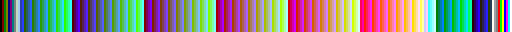

### Macintosh
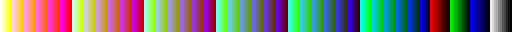

### Websafe
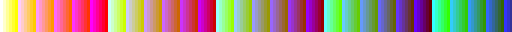

### Grayscale

### Monochrome

## Uniform Palettes

### UniformPs

### These palettes were derived by reducing all 24-bit colors to just 256 colors using…

#### UniformAseprite

…Aseprite's Octree method.

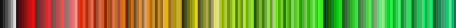

#### UniformFfmpeg

…ffmpeg's palettegen filter.

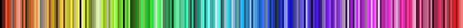

#### UniformPerceptual

…Photoshop's Perceptual method.

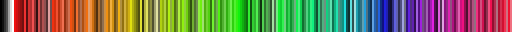

#### UniformSelective

…Photoshop's Selective method.

## Palettes from [gradient-rs](https://github.com/mazznoer/gradient-rs)

### Blues

### BrBg

### BuGn

### BuPu

### Cividis

### Cool

### Cubehelix

### GnBu

### Greens

### Inferno

### Magma

### OrRd

### Oranges

### PiYg

### Plasma

### PrGn

### PuBu

### PuBuGn

### PuOr

### PuRd

### Purples

### Rainbow

### RdBu

### RdGy

### RdPu

### RdYlBu

### RdYlGn

### Reds

### Sinebow

### Spectral

### Turbo

### Viridis

### Warm

### YlGn

### YlGnBu

### YlOrBr

### YlOrRd

## Palettes by [Adigun Polack](https://twitter.com/AdigunPolack)

### AAP64

### AAPMicro12

### AAPRadiantXV

### AAPSplendor128
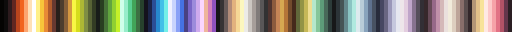

### SimpleJPC16

## Palettes by [Arne Niklas Jansson](https://androidarts.com/palette/16pal.htm)

### A64

### ARNE16

### ARNE32

### CgArne

### CopperTech

### CpcBoy

### ErogeCopper

### Jmp

### Psygnosia

## Palettes by [Davit Masia](https://twitter.com/DavitMasia)

### Matriax8c

## Palettes by [Richard "DawnBringer" Fhager](https://hem.fyristorg.com/dawnbringer/)

### DB8

### DB16

### DB32

## Palettes by [ENDESGA Studios](https://twitter.com/ENDESGA)

### ARQ4

### ARQ16

### EDG8

### EDG16

### EDG32
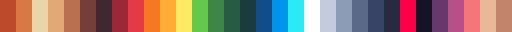

### EN4

### ENOS16

### HEPT32

## Palettes by [Hyohnoo](https://twitter.com/Hyohnoo)

### Mail24

## Palettes by [Javier Guerrero](https://twitter.com/Xavier_Gd)

### Nyx8

## Palettes by [Joseph White](https://www.pico-8.com/)

### Pico8

## Palettes by [PineTreePizza](https://twitter.com/PineTreePizza)

### Bubblegum16

### Rosy42
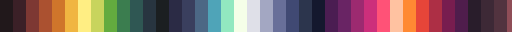

## Palettes by [Zughy](https://twitter.com/_Zughy)

### Zughy32

## Hardware Palettes [from the Aseprite project](https://github.com/aseprite/aseprite/tree/8323a555007e1db9670b098ce4b1b9c5f8b3d7ad/data/extensions/hardware-palettes)

### AppleII

### Atari2600Ntsc
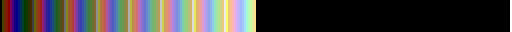

### Atari2600Pal
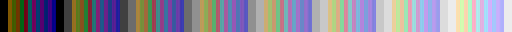

### Cga

### Cga0

### Cga0High

### Cga1

### Cga1High

### Cga3rd

### Cga3rdHigh

### CommodorePlus4
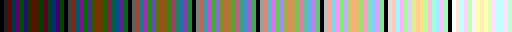

### CommodoreVic20

### Commodore64

### Cpc

### Gameboy

### GameboyColor

### MasterSystem

### MSX1

### MSX2

### Nes

### NesNtsc

### Teletext

### VGA13h

### VirtualBoy

### ZXSpectrum

## Software Palettes [from the Aseprite project](https://github.com/aseprite/aseprite/tree/8323a555007e1db9670b098ce4b1b9c5f8b3d7ad/data/extensions/software-palettes)

### GoogleUI
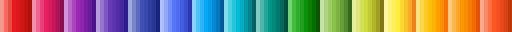

### Minecraft

### Monokai

### SmileBasic

### Solarized

### Win16

### X11
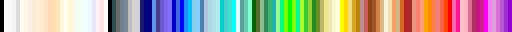
