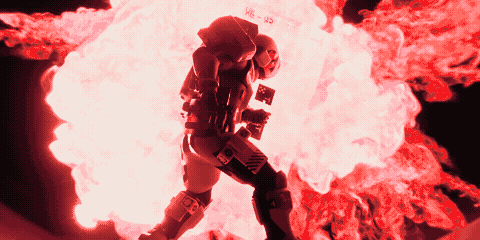
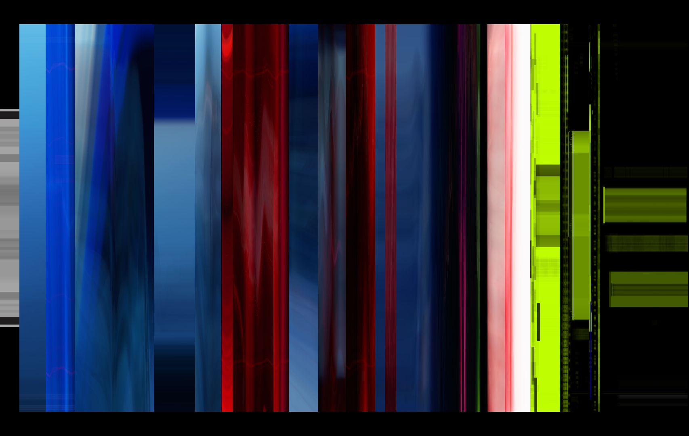
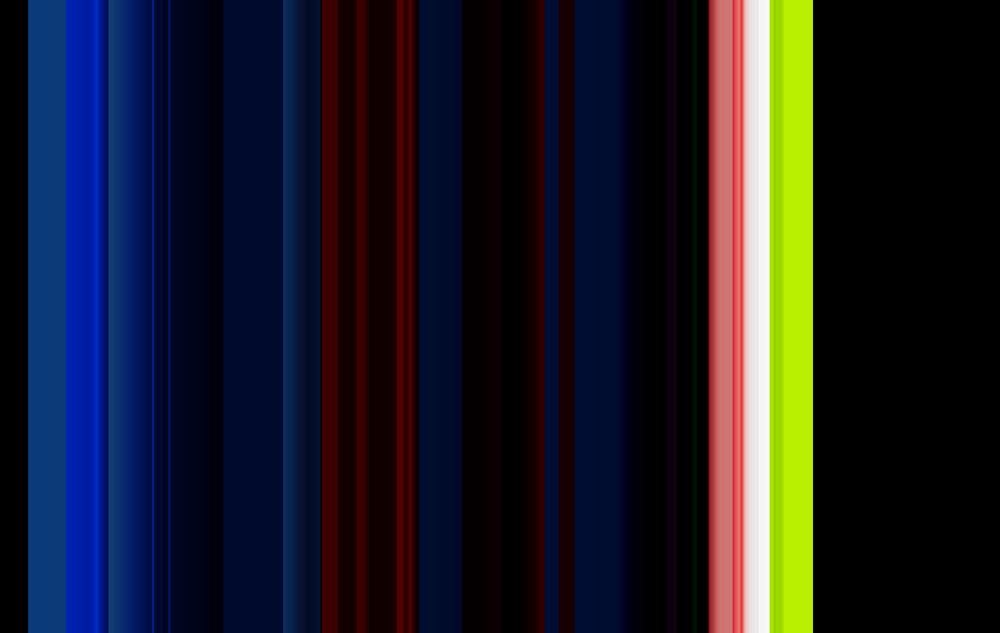

# ffauto-rs

## What is this?
This is a Rust-based swiss army knife of sorts for some common ffmpeg tasks. It is the successor to [ffauto.py](https://github.com/SamusAranX/ffauto).

## What *isn't* this?
Like its predecessor, this isn't optimized to be particularly fast, as it uses slower encoder presets to get higher visual quality.

Hardware acceleration also isn't really supported, so encoding will happen on the CPU and be appropriately slower than GPU-assisted encoding.

## Table of Contents
- [`auto`](#auto) · Wrapper around common ffmpeg operations
- [`gif`](#gif) · Wrapper around ffmpeg's GIF creation functionality
- [`quant`](#quant) · Like the `gif` subcommand but for still images
- [`barcode`](#barcode) · Movie "barcode" generator
- [`info`](#info) · Print formatted ffprobe stream information
- [Output Examples](#output-examples) · Some example output from the `gif`, `quant`, and `barcode` commands
- [Command Examples](#command-examples) · A list of examples of common workflows
---

## `auto`

<details>
<summary>Command help text</summary>

```
Wrapper around common ffmpeg operations

Usage: ff auto [OPTIONS] -i <INPUT> <OUTPUT>

Arguments:
  <OUTPUT>  The output file

Options:
  -i <INPUT>
          The input file
      --video-streams <VIDEO_STREAMS>
          Selects video streams by index or ISO 639-2 language code [default: 0]
      --audio-streams <AUDIO_STREAMS>
          Selects audio streams by index or ISO 639-2 language code [default: 0]
      --sub-streams <SUB_STREAMS>
          Selects subtitle streams by index or ISO 639-2 language code
  -B, --burn-subtitle
          (WIP, currently nonfunctional) Burns the first specified subtitle stream into the output video stream. All further specified subtitle streams will be ignored
  -s, --seek <SEEK>
          The start time offset
  -t <DURATION>
          The output duration
      --to <DURATION_TO>
          The end time offset
  -X, --remove-bars
          Attempts to crop off pillar- or letterboxing automatically before applying any manual cropping or scaling operations
  -c, --crop <CROP>
          Crops the output video. Format: H, WxH, or WxH,X;Y
      --vw <WIDTH>
          Sets the output video width, preserving aspect ratio
      --vh <HEIGHT>
          Sets the output video height, preserving aspect ratio
      --vs <SIZE_FIT>
          Sets the rectangle the output video size will fit into. Format: WxH or an ffmpeg size name
      --vS <SIZE_FILL>
          Sets the rectangle the output video will fill. Format: WxH or an ffmpeg size name
  -S, --scale-mode <SCALE_MODE>
          Sets the scaling algorithm used [default: bicubic] [possible values: fast-bilinear, bilinear, bicubic, neighbor, area, bicublin, gauss, sinc, lanczos, spline]
  -T, --tonemap
          Performs an HDR-to-SDR tonemap
  -F, --faststart
          Moves moov atom to the start. (Enabled by default, use -F=false to disable)
  -H, --hwaccel
          Experimental: Enables hardware-assisted decoding. Might break things
  -a, --accelerator <ACCELERATOR>
          Used with --hwaccel. Defaults to "videotoolbox" on macOS and "auto" everywhere else [default: videotoolbox]
  -M, --mute
          Removes the audio stream
  -v, --volume <AUDIO_VOLUME>
          Sets the output audio volume factor [default: 1]
      --channels <AUDIO_CHANNELS>
          Sets the number of output audio channels
  -f, --fade <FADE>
          Sets the fade in and out durations. Takes precedence over --fi/--fo [default: 0]
      --fi <FADE_IN>
          Sets the fade in duration [default: 0]
      --fo <FADE_OUT>
          Sets the fade out duration [default: 0]
  -r, --framerate <FRAMERATE>
          Sets the output video frame rate
  -R, --framerate-mult <FRAMERATE_MULT>
          Sets the output video frame rate to a factor of the input video frame rate
  -C, --codec <VIDEO_CODEC>
          The output video codec [default: h264] [possible values: h264, h265, h265-10]
  -O, --optimize <OPTIMIZE_TARGET>
          Optimizes settings for certain devices [possible values: ipod5, ipod, psp, ps-vita]
  -g...
          Increasingly reduces video quality (in turn reducing output file size) depending on how often this was specified
  -h, --help
          Print help (see more with '--help')
```

</details>

### Required Options

* `-i <INPUT>`: The input file.
* `<OUTPUT>`: The output file. Must be the last argument.

### Stream Selection

* `--video-streams <VIDEO_STREAMS>`: Selects one or more video streams by numeric index or ISO 639-2 language code (e.g. `eng`, `jpn`). Defaults to the first stream.
* `--audio-streams <AUDIO_STREAMS>`: Selects one or more audio streams by index or ISO 639-2 language code. Defaults to the first stream.
* `--sub-streams <SUB_STREAMS>`: Selects subtitle streams by index or language code. External subtitle files can also be provided as a path, optionally suffixed with `:lang` to set the language (e.g. `movie.eng.srt` or `subs.srt:eng`). When not specified, existing subtitles are passed through automatically (except PGS/Blu-ray subtitles, which are always dropped).

### Seeking and Trimming

Timestamps can be given in any of these formats: `H:MM:SS.f`, `H:MM:SS`, `M:SS.f`, `M:SS`, or as plain seconds.

* `-s/--seek <SEEK>`: Skip to this position in the input before encoding.
* `-t <DURATION>`: Limit the output to this duration. Can't be used with `--to`.
* `--to <DURATION_TO>`: Stop output at this timestamp. Has to be later than the timestamp given for `-s` or weird things happen. Can't be used with `-t`.

### Cropping

* `-X/--remove-bars`: Automatically detect and remove pillar- or letterboxing. Applied before any manual crop or scale operations.
* `-c/--crop <CROP>`: Crop the video. Three formats are accepted:
    * `H`: centered crop to `(original video width)`×`H`
    * `WxH`: centered crop to `W`×`H`
    * `WxH,X;Y`: crop to `W`×`H` at offset `X`, `Y`

The separators `x`, `,`, and `;` are used for demonstration purposes, but any separators can be used here.

### Scaling

The following arguments are all mutually exclusive. Only one of them may be specified at a time.

* `--vw <WIDTH>`: Resize to this width, preserving aspect ratio.
* `--vh <HEIGHT>`: Resize to this height, preserving aspect ratio.
* `--vs <SIZE>`: Fit the video into a bounding box. Accepts `WxH` (e.g. `1280x720`) or an [ffmpeg size name](https://ffmpeg.org/ffmpeg-utils.html#Video-size) (e.g. `hd720`).
* `--vS <SIZE>`: Makes the video fill the specified bounding box. Accepts the same values as `--vs`.

Additionally, this argument may be used to control the scaling algorithm:

* `-S/--scale-mode <SCALE_MODE>`: Scaling algorithm. Default: `bicubic`. Options: `fast-bilinear`, `bilinear`, `bicubic`, `neighbor`, `area`, `bicublin`, `gauss`, `sinc`, `lanczos`, `spline`.

**Note:** Manual cropping and scaling are applied in the order in which `-c`/`--crop` and the scaling arguments (`--vw`, `--vh`, `--vs`, `--vS`) appear on the command line.\
This way you can control whether you crop *before* or *after* scaling.

### Video Codec

* `-C/--codec <VIDEO_CODEC>`: The video codec to use. Default: `h264`.
    * `h264`: H.264 via libx264 (tune: film).
    * `h265`: H.265 8-bit via libx265 (tune: grain, tagged as `hvc1`).
    * `h265-10`: H.265 10-bit via libx265. HDR content is only tonemapped to SDR if `-T` is also passed.

### HDR

* `-T/--tonemap`: Perform an HDR-to-SDR tonemap. Applied automatically when encoding HDR source material to `h264` or `h265`. HDR content is preserved when the specified codec is `h265-10`, but `-T` may be specified explicitly if tonemapped 10-bit SDR output is desired.

### Audio

* `-M/--mute`: Remove all audio from the output.
* `-v/--volume <AUDIO_VOLUME>`: Multiply the audio volume by this factor. Can't be used with `--mute`. Default: `1`.
* `--channels <AUDIO_CHANNELS>`: Downmixes audio streams to this many channels. Can theoretically be used to **up**mix streams to a greater amount of channels, but why would you do that?

Audio is copied without re-encoding when the source is already AAC and no audio filters are needed. Otherwise it is reencoded to AAC at 256 kbps.

### Fades

Fades apply to audio and video streams at the same time.

* `-f/--fade <FADE>`: Apply both a fade-in and a fade-out of this duration (in seconds). Takes precedence over `--fi`/`--fo`.
* `--fi <FADE_IN>`: Apply a fade-in only. Ignored if `-f` is given.
* `--fo <FADE_OUT>`: Apply a fade-out only. Ignored if `-f` is given.

### Frame Rate

* `-r/--framerate <FRAMERATE>`: Set an absolute output frame rate.
* `-R/--framerate-mult <FRAMERATE_MULT>`: Set output frame rate as a multiple of the input rate. Can't be used with `-r`.

### Device-Specific Video Optimization

* `-O/--optimize <OPTIMIZE_TARGET>`: Apply a device-specific encoding preset. Overrides resolution, codec profile, bitrate limits, and audio settings.
    * `ipod5`: 5th generation iPod (320×240, H.264 Baseline 1.3, max 768 kbps)
    * `ipod`: Newer video-capable iPods (640×480, H.264 Baseline 3.0, max 2.5 Mbps)
    * `psp`: Sony PSP (480×272, H.264 Main 3.0, max 3 Mbps)
    * `ps-vita`: PS Vita (960×540, H.264 High 4.1, max 10 Mbps)

### Miscellaneous

* `-F/--faststart`: Move the MP4 moov atom to the start of the file for faster streaming. Enabled by default, can be disabled with `-F=false`.
* `-g`: Reduce output quality to shrink file size. Stackable: `-gg`, `-ggg`, etc. reduce quality further each time.
* `-H/--hwaccel`: Enable hardware-assisted decoding (experimental). On macOS defaults to VideoToolbox; elsewhere defaults to `auto`.
* `-a/--accelerator <ACCELERATOR>`: Override the hardware accelerator name. Only useful when `-H` is also specified.

---

## `gif`

<details>
<summary>Command help text</summary>

```
Wrapper around ffmpeg's GIF creation functionality

Usage: ff gif [OPTIONS] -i <INPUT> <OUTPUT>

Arguments:
  <OUTPUT>  The output file

Options:
  -i <INPUT>
          The input file
      --video-stream <VIDEO_STREAM>
          Selects a video stream by index [default: 0]
      --video-lang <VIDEO_LANGUAGE>
          Selects a video stream by language. (ISO 639-2)
  -s, --seek <SEEK>
          The start time offset
  -t <DURATION>
          The output duration
      --to <DURATION_TO>
          The end time offset
  -X, --remove-bars
          Attempts to crop off pillar- or letterboxing automatically before applying any manual cropping or scaling operations
  -c, --crop <CROP>
          Crops the output video. Format: H, WxH, or WxH,X;Y
      --vw <WIDTH>
          Sets the output video width, preserving aspect ratio
      --vh <HEIGHT>
          Sets the output video height, preserving aspect ratio
      --vs <SIZE_FIT>
          Sets the rectangle the output video size will fit into. Format: WxH or an ffmpeg size name
      --vS <SIZE_FILL>
          Sets the rectangle the output video will fill. Format: WxH or an ffmpeg size name
  -S, --scale-mode <SCALE_MODE>
          Sets the scaling algorithm used [default: bicubic] [possible values: fast-bilinear, bilinear, bicubic, neighbor, area, bicublin, gauss, sinc, lanczos, spline]
  -f, --fade <FADE>
          Sets the fade in and out durations. Takes precedence over --fi/--fo [default: 0]
      --fi <FADE_IN>
          Sets the fade in duration [default: 0]
      --fo <FADE_OUT>
          Sets the fade out duration [default: 0]
  -r, --framerate <FRAMERATE>
          Sets the output video frame rate
  -R, --framerate-mult <FRAMERATE_MULT>
          Sets the output video frame rate to a factor of the input video frame rate
      --dedup
          Attempts to deduplicate frames
      --brightness <BRIGHTNESS>
          Affects the output brightness, range [-1.0;1.0] [default: 0]
      --contrast <CONTRAST>
          Affects the output contrast, range [-1000.0;1000.0] [default: 1]
      --saturation <SATURATION>
          Affects the output saturation, range [0.0;3.0] [default: 1]
      --sharpness <SHARPNESS>
          Affects the output sharpness, range [-1.5;1.5] [default: 0]
      --palette-file <PALETTE_FILE>
          A file containing a palette. (supports ACT, COL, GPL, HEX, and PAL formats)
      --palette-static <PALETTE_STATIC>
          A static palette. See also PALETTES_STATIC.md in the project repository [possible values: cmyk, windows, macintosh, websafe, uniform-ps, uniform-aseprite, uniform-ffmpeg, uniform-perceptual, uniform-selective, aap64, aap-micro12, aap-radiant-xv, aap-splendor128, simple-jpc16, a64, arne16, arne32, cg-arne, copper-tech, cpc-boy, eroge-copper, jmp, psygnosia, matriax8c, db8, db16, db32, arq4, arq16, edg8, edg16, edg32, en4, enos16, hept32, mail24, nyx8, pico8, bubblegum16, rosy42, zughy32, apple-ii, atari2600-ntsc, atari2600-pal, cga, cga0, cga0-high, cga1, cga1-high, cga3rd, cga3rd-high, commodore-plus4, commodore-vic20, commodore64, cpc, gameboy, gameboy-color, master-system, msx1, msx2, nes, nes-ntsc, teletext, vga13h, virtual-boy, zx-spectrum, google-ui, minecraft, monokai, smile-basic, solarized, win16, x11]
      --palette-dynamic <PALETTE_DYNAMIC>
          A dynamic palette. See also PALETTES_DYNAMIC.md in the project repository [possible values: br-bg, pr-gn, pi-yg, pu-or, rd-bu, rd-gy, rd-yl-bu, rd-yl-gn, spectral, blues, greens, greys, oranges, purples, reds, turbo, viridis, inferno, magma, plasma, cividis, warm, cool, cubehelix, bu-gn, bu-pu, gn-bu, or-rd, pu-bu-gn, pu-bu, pu-rd, rd-pu, yl-gn-bu, yl-gn, yl-or-br, yl-or-rd, rainbow, sinebow]
      --palette-gradient <PALETTE_GRADIENT>
          Steps for a custom gradient palette. At least 2 colors must be specified. Accepts CSS colors as arguments. Pass a value for --palette-steps to control how many palette colors to pick from this gradient
      --palette-steps <PALETTE_STEPS>
          The number of colors in the palette. Only used with dynamic, gradient, and generated palettes [default: 256]
      --stats-mode <STATS_MODE>
          The statistics mode. (palettegen) [default: full] [possible values: full, diff, single]
  -D, --dither <DITHER>
          The dithering mode. (paletteuse) [default: sierra2-4a] [possible values: bayer, heckbert, floyd-steinberg, sierra2, sierra2-4a, sierra3, burkes, atkinson, none]
      --bayer-scale <BAYER_SCALE>
          The bayer pattern scale in the range [0;5] (paletteuse) [default: 2]
      --diff-rect
          Only reprocess the changed rectangle. (Helps with noise and compression) (paletteuse)
  -h, --help
          Print help (see more with '--help')
```

</details>

### Required Options

* `-i <INPUT>`: The input file.
* `<OUTPUT>`: The output file. Must be the last argument.

### Stream Selection

* `--video-stream <VIDEO_STREAM>`: Select the video stream by index. Default: `0`. Can't be used with `--video-lang`.
* `--video-lang <VIDEO_LANGUAGE>`: Select the video stream by ISO 639-2 language code. Can't be used with `--video-stream`.

### Seeking and Trimming

[Same options as for the `auto` subcommand.](#scaling)

### Cropping

[Same options as for the `auto` subcommand.](#cropping)

### Scaling

[Same options as for the `auto` subcommand.](#scaling)

### Frame Rate

[Same options as for the `auto` subcommand](#frame-rate), but also:

* `--dedup`: Enable variable frame rate output and drop duplicate frames, reducing file size for content with repeated frames.

### Fades

[Same options as for the `auto` subcommand.](#fades)

### Color Adjustments

* `--brightness <BRIGHTNESS>`: Brightness adjustment. Range `[-1.0, 1.0]`. Default: `0`.
* `--contrast <CONTRAST>`: Contrast multiplier. Range `[-1000.0, 1000.0]`. Default: `1`.
* `--saturation <SATURATION>`: Saturation multiplier. Range `[0.0, 3.0]`. Default: `1`.
* `--sharpness <SHARPNESS>`: Sharpness adjustment. Range `[-1.5, 1.5]`. Default: `0`.

### Palette

At most one palette source may be specified. When none is given, a palette is generated from the input video.

Check out [PALETTES_STATIC.md](docs/PALETTES_STATIC.md) and [PALETTES_DYNAMIC.md](docs/PALETTES_DYNAMIC.md) for visualizations of available palettes and options.

* `--pf/--palette-file <PALETTE_FILE>`: Load a palette from a file. Supported formats: ACT, COL, GPL, HEX, PAL.
* `--ps/--palette-static <PALETTE_STATIC>`: Use a fixed built-in palette. Includes hardware palettes (`gameboy`, `nes`, `cga`, `commodore64`, `zx-spectrum`, …) and pixel art palettes (`db16`, `db32`, `pico8`, `arne32`, …).
* `--pd/--palette-dynamic <PALETTE_DYNAMIC>`: Use a scientific gradient palette sampled to `--palette-steps` colors (`viridis`, `inferno`, `turbo`, `plasma`, …).
* `--pg/--palette-gradient <COLOR>...`: Build a custom gradient palette from two or more CSS color values. Sample count is controlled by `--palette-steps`.
* `--pn/--palette-steps <N>`: Number of colors to sample from dynamic, gradient, or auto-generated palettes. Default: `256`.

### Palette Generation (see also [`palettegen`](https://ffmpeg.org/ffmpeg-filters.html#palettegen-1))

Only applies when no palette source (`--palette-file`, `--palette-static`, `--palette-dynamic`, `--palette-gradient`) is given.

* `--stats-mode <STATS_MODE>`: How the palette is computed. Default: `full`.
    * `full`: Generate one palette for the entire video.
    * `diff`: Only consider parts of frames that don't change from the previous frame. Good for static backgrounds.
    * `single`: Generate a fresh palette per frame.

### Dithering (see also [`paletteuse`](https://ffmpeg.org/ffmpeg-filters.html#paletteuse))

* `-D/--dither <DITHER>`: Dithering algorithm. Default: `sierra2-4a`. Options: `bayer`, `heckbert`, `floyd-steinberg`, `sierra2`, `sierra2-4a`, `sierra3`, `burkes`, `atkinson`, `none`.
* `--bayer-scale <BAYER_SCALE>`: How far the Bayer pattern should be spread out, range `[0, 5]`. Lower values spread the pattern out further, higher values make it smaller. Default: `2`.
* `--diff-rect`: Only re-dither the bounding box of the region that changed each frame. May improve GIF compression.

---

## `quant`

<details>
<summary>Command help text</summary>

```
Like the gif subcommand but for still images

Usage: ff quant [OPTIONS] -i <INPUT> <OUTPUT>

Arguments:
  <OUTPUT>  The output file

Options:
  -i <INPUT>
          The input file
      --video-stream <VIDEO_STREAM>
          Selects a video stream by index [default: 0]
      --video-lang <VIDEO_LANGUAGE>
          Selects a video stream by language. (ISO 639-2)
  -s, --seek <SEEK>
          The start time offset
  -X, --remove-bars
          Attempts to crop off pillar- or letterboxing automatically before applying any manual cropping or scaling operations
  -c, --crop <CROP>
          Crops the output video. Format: H, WxH, or WxH,X;Y
      --vw <WIDTH>
          Sets the output video width, preserving aspect ratio
      --vh <HEIGHT>
          Sets the output video height, preserving aspect ratio
      --vs <SIZE_FIT>
          Sets the rectangle the output video size will fit into. Format: WxH or an ffmpeg size name
      --vS <SIZE_FILL>
          Sets the rectangle the output video will fill. Format: WxH or an ffmpeg size name
  -S, --scale-mode <SCALE_MODE>
          Sets the scaling algorithm used [default: bicubic] [possible values: fast-bilinear, bilinear, bicubic, neighbor, area, bicublin, gauss, sinc, lanczos, spline]
      --brightness <BRIGHTNESS>
          Affects the output brightness, range [-1.0;1.0] [default: 0]
      --contrast <CONTRAST>
          Affects the output contrast, range [-1000.0;1000.0] [default: 1]
      --saturation <SATURATION>
          Affects the output saturation, range [0.0;3.0] [default: 1]
      --sharpness <SHARPNESS>
          Affects the output sharpness, range [-1.5;1.5] [default: 0]
      --palette-file <PALETTE_FILE>
          A file containing a palette. (supports ACT, COL, GPL, HEX, and PAL formats)
      --palette-static <PALETTE_STATIC>
          A static palette. See also PALETTES_STATIC.md in the project repository [possible values: cmyk, windows, macintosh, websafe, uniform-ps, uniform-aseprite, uniform-ffmpeg, uniform-perceptual, uniform-selective, aap64, aap-micro12, aap-radiant-xv, aap-splendor128, simple-jpc16, a64, arne16, arne32, cg-arne, copper-tech, cpc-boy, eroge-copper, jmp, psygnosia, matriax8c, db8, db16, db32, arq4, arq16, edg8, edg16, edg32, en4, enos16, hept32, mail24, nyx8, pico8, bubblegum16, rosy42, zughy32, apple-ii, atari2600-ntsc, atari2600-pal, cga, cga0, cga0-high, cga1, cga1-high, cga3rd, cga3rd-high, commodore-plus4, commodore-vic20, commodore64, cpc, gameboy, gameboy-color, master-system, msx1, msx2, nes, nes-ntsc, teletext, vga13h, virtual-boy, zx-spectrum, google-ui, minecraft, monokai, smile-basic, solarized, win16, x11]
      --palette-dynamic <PALETTE_DYNAMIC>
          A dynamic palette. See also PALETTES_DYNAMIC.md in the project repository [possible values: br-bg, pr-gn, pi-yg, pu-or, rd-bu, rd-gy, rd-yl-bu, rd-yl-gn, spectral, blues, greens, greys, oranges, purples, reds, turbo, viridis, inferno, magma, plasma, cividis, warm, cool, cubehelix, bu-gn, bu-pu, gn-bu, or-rd, pu-bu-gn, pu-bu, pu-rd, rd-pu, yl-gn-bu, yl-gn, yl-or-br, yl-or-rd, rainbow, sinebow]
      --palette-gradient <PALETTE_GRADIENT>
          Steps for a custom gradient palette. At least 2 colors must be specified. Accepts CSS colors as arguments. Pass a value for --palette-steps to control how many palette colors to pick from this gradient
      --palette-steps <PALETTE_STEPS>
          The number of colors in the palette. Only used with dynamic, gradient, and generated palettes [default: 256]
  -D, --dither <DITHER>
          The dithering mode (paletteuse) [default: sierra2-4a] [possible values: bayer, heckbert, floyd-steinberg, sierra2, sierra2-4a, sierra3, burkes, atkinson, none]
      --bayer-scale <BAYER_SCALE>
          The bayer pattern scale in the range [0;5] (paletteuse) [default: 2]
  -h, --help
          Print help (see more with '--help')
```

</details>

`quant` extracts a single frame from the input and quantizes it to a reduced color palette using the same `palettegen`/`paletteuse` pipeline as `gif`. Useful for producing indexed PNG images (pixel art, thumbnails, etc.) from video frames or still images.

### Required Options

* `-i <INPUT>`: The input file (video or still image).
* `<OUTPUT>`: The output file.

### Stream Selection

[Same options as for the `gif` subcommand.](#stream-selection-1)

### Seeking and Trimming

[Same options as for the `auto` and `gif` subcommands.](#scaling)

### Cropping

[Same options as for the `auto` and `gif` subcommands.](#cropping)

### Scaling

[Same options as for the `auto` and `gif` subcommands.](#scaling)

### Color Adjustments

[Same options as for the `gif` subcommand.](#color-adjustments)

### Palette

[Same options as for the `gif` subcommand.](#palette)

### Dithering

[Same options as for the `auto` and `gif` subcommands.](#dithering-see-also-paletteuse)

---

## `barcode`

<details>
<summary>Command help text</summary>

```
Movie "barcode" generator

Usage: ff barcode [OPTIONS] -i <INPUT> <OUTPUT>

Arguments:
  <OUTPUT>  The output file. (always outputs PNG)

Options:
  -i <INPUT>                         The input file
  -X, --remove-bars                  Attempts to crop off pillar- or letterboxing automatically before applying any manual cropping or scaling operations
      --video-stream <VIDEO_STREAM>  Selects a video stream by index [default: 0]
      --video-lang <VIDEO_LANGUAGE>  Selects a video stream by language. (ISO 639-2)
  -f, --frames <VIDEO_FRAMES>        Override the number of frames, skipping ffprobe's potentially lengthy frame counting process
  -B, --barcode-mode <BARCODE_MODE>  The barcode strip generation method [default: frames] [possible values: frames, colors]
  -D, --deep-color                   Outputs a 48-bit PNG
      --vh <HEIGHT>                  Sets the output barcode image's height. (defaults to the input video's height)
  -h, --help                         Print help
```

</details>

Generates a "movie barcode": a single image where each column represents one frame of the video, compressed to a 1-pixel-wide strip and tiled side by side. The output is always a PNG.

### Required Options

* `-i <INPUT>`: The input file.
* `<OUTPUT>`: The output PNG file.

### Stream Selection

[Same options as for the `gif` and `quant` subcommands.](#stream-selection-1)

### Options

* `-X/--remove-bars`: Automatically detect and remove pillar- or letterboxing before generating the barcode.
* `-f/--frames <VIDEO_FRAMES>`: Override the total frame count. By default `barcode` runs a full frame count, which can take a long time on long video files. If you already know the frame count, pass it here to skip that step.
* `-B/--barcode-mode <BARCODE_MODE>`: How each frame is reduced to a one pixel wide strip. Default: `frames`.
    * `frames`: Horizontally compresses whole frames.
    * `colors`: Extracts every frame's dominant color and uses that instead.
* `-D/--deep-color`: Output a 48-bit (16 bits per channel) PNG, resulting in less color banding compared to a normal 24-bit (8 bits per channel) PNG.
* `--vh <HEIGHT>`: Set the output image height in pixels. The width is always equal to the frame count. Defaults to the input video's height.

---

## `info`

<details>
<summary>Command help text</summary>

```
Outputs information about a media file

Usage: ff info [OPTIONS] -i <INPUT>

Options:
  -i <INPUT>      The input file
  -C, --no-color  Disables color output. The NO_COLOR environment variable is also supported
  -h, --help      Print help
```

</details>

Outputs a (by default) colorized, human-readable summary of an input file's streams.\
The output format is very similar to ffprobe's, except numerical global and type indices are also shown. This format follows this rough pattern:

```
[global_index|type_index] TYPE(lang, "title", default): ...details...
```

For example, taking a normal file containing one video and audio stream each might produce output like this:

```
[0|0] Video(und, default): vp9 (Profile 0), yuv420p (tv, bt709), 3840×2160, 30 fps
[1|0] Audio(eng, default): aac (LC), 44100 Hz, 2ch: stereo, fltp, 127.999 kb/s
```

### Options

* `-i <INPUT>`: The input file.
* `-C/--no-color`: Disables colorized output. Also applies if the `NO_COLOR` environment variable is set.

---

## Output Examples

All of these used [this video](https://www.youtube.com/watch?v=1_tFPT5X2hs) as the input.

### Animated GIFs

<details>
<summary>An animated GIF using the built-in four-color Game Boy palette and Bayer dithering</summary>


</details>

### Static quantized images

<details>
<summary>A static image using 16 colors and Bayer dithering</summary>


</details>

### Barcodes

<details>
<summary>Two barcodes, showcasing the "frames" and "colors" modes respectively</summary>




</details>

---

## Command Examples

### Cut a 10-second clip starting at 1:30
```sh
ff auto -i input.mp4 -s 1:30 -t 10 output.mp4
```

### Cut from 0:45 to 1:15
```sh
ff auto -i input.mp4 -s 0:45 --to 1:15 output.mp4
```

### Apply a half-second fade in and fade out
```sh
ff auto -i input.mp4 -f 0.5 output.mp4
```

### Apply a one-second fade in, but no fade out
```sh
ff auto -i input.mp4 --fi 1.0 output.mp4
```

### Double the audio volume
```sh
ff auto -i input.mp4 -v 2.0 output.mp4
```

### Halve the audio volume
```sh
ff auto -i input.mp4 -v 0.5 output.mp4
```

### Remove the audio track entirely
```sh
ff auto -i input.mp4 -M output.mp4
```

### Resize to 720 pixels tall, preserving aspect ratio
```sh
ff auto -i input.mp4 --vh 720 output.mp4
```

### Resize to 1280 pixels wide, preserving aspect ratio
```sh
ff auto -i input.mp4 --vw 1280 output.mp4
```

### Fit into a 1280×720 bounding box, preserving aspect ratio
```sh
ff auto -i input.mp4 --vs 1280x720 output.mp4
```

### Crop to a centered 1920×1080 region, then scale down to 720p
```sh
ff auto -i input.mp4 -c 1920x1080 --vh 720 output.mp4
```

### Encode to H.265, resizing to 1080p
```sh
ff auto -i input.mp4 -C h265 --vh 1080 --fo 0.5 output.mov
```

### Downscale to 480p and reduce quality to shrink file size
```sh
ff auto -i input.mp4 --vh 480 -gg output.mp4
```

### Keep only the English audio track and pass through Japanese subtitles
```sh
ff auto -i input.mkv --audio-streams eng --sub-streams jpn output.mp4
```

### Create a 15 fps GIF from a 5-second clip, scaled to 480px width
```sh
ff gif -i input.mp4 -s 0:10 -t 5 -r 15 --vw 480 output.gif
```

### Create a GIF using the Game Boy palette and use Bayer (or "ordered") dithering
```sh
ff gif -i input.mp4 -t 4 --vh 360 --palette-static gameboy -D bayer output.gif
```

### Quantize a still image to 16 colors using Floyd-Steinberg dithering
```sh
ff quant -i input.png --palette-steps 16 -D floyd-steinberg output.png
```

### Quantize the frame at the 30-second mark of a video
```sh
ff quant -i input.mp4 -s 30 output.png
```

### Generate a movie barcode from a film
```sh
ff barcode -i movie.mkv barcode.png
```

### Generate a movie barcode, skipping the frame counting step
```sh
ff barcode -i movie.mkv -f 172800 --vh 200 barcode.png
```

### Show stream information for a file
```sh
ff info -i input.mkv
```
