# List of static palettes

These palettes are made of a fixed number of colors.

## Standard Palettes

### Cmyk

### Windows
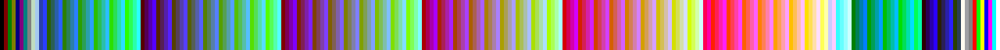

### Macintosh
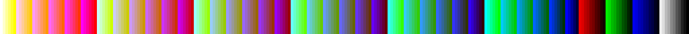

### Websafe

## Uniform Palettes

### UniformPs
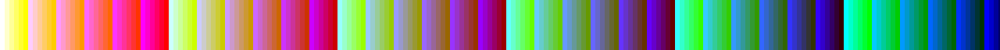

### These palettes were derived by reducing all 24-bit colors to just 256 colors using…

#### UniformAseprite

…Aseprite's Octree method.

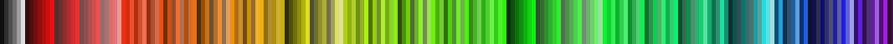

#### UniformFfmpeg

…ffmpeg's palettegen filter.

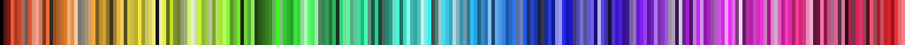

#### UniformPerceptual

…Photoshop's Perceptual method.

#### UniformSelective

…Photoshop's Selective method.

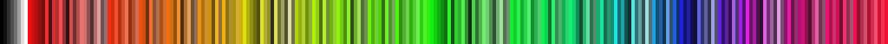

## Palettes by [Adigun Polack](https://twitter.com/AdigunPolack)

### AAP64
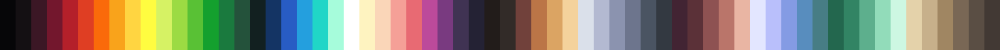

### AAPMicro12

### AAPRadiantXV

### AAPSplendor128
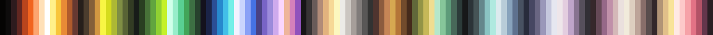

### SimpleJPC16

## Palettes by [Arne Niklas Jansson](https://androidarts.com/palette/16pal.htm)

### A64

### ARNE16

### ARNE32
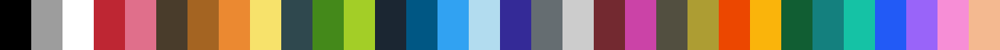

### CgArne

### CopperTech

### CpcBoy

### ErogeCopper

### Jmp

### Psygnosia

## Palettes by [Davit Masia](https://twitter.com/DavitMasia)

### Matriax8c

## Palettes by [Richard "DawnBringer" Fhager](https://hem.fyristorg.com/dawnbringer/)

### DB8

### DB16

### DB32

## Palettes by [ENDESGA Studios](https://twitter.com/ENDESGA)

### ARQ4

### ARQ16

### EDG8

### EDG16

### EDG32
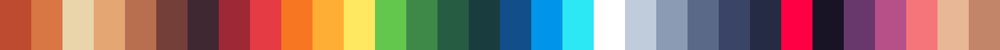

### EN4

### ENOS16

### HEPT32

## Palettes by [Hyohnoo](https://twitter.com/Hyohnoo)

### Mail24

## Palettes by [Javier Guerrero](https://twitter.com/Xavier_Gd)

### Nyx8

## Palettes by [Joseph White](https://www.pico-8.com/)

### Pico8

## Palettes by [PineTreePizza](https://twitter.com/PineTreePizza)

### Bubblegum16

### Rosy42
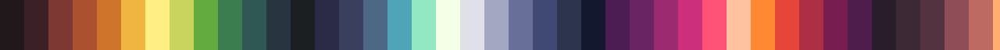

## Palettes by [Zughy](https://twitter.com/_Zughy)

### Zughy32
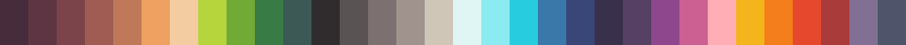

## Hardware Palettes [from the Aseprite project](https://github.com/aseprite/aseprite/tree/8323a555007e1db9670b098ce4b1b9c5f8b3d7ad/data/extensions/hardware-palettes)

### AppleII

### Atari2600Ntsc
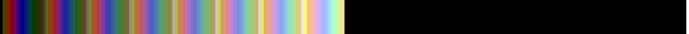

### Atari2600Pal
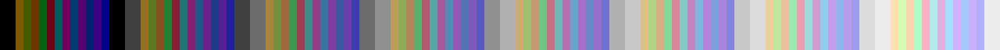

### Cga

### Cga0

### Cga0High

### Cga1

### Cga1High

### Cga3rd

### Cga3rdHigh

### CommodorePlus4
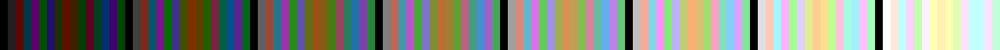

### CommodoreVic20

### Commodore64

### Cpc
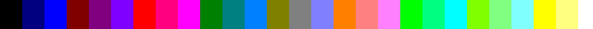

### Gameboy

### GameboyColor
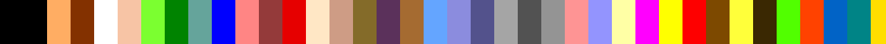

### MasterSystem
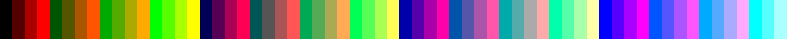

### MSX1

### MSX2

### Nes

### NesNtsc

### Teletext

### VGA13h
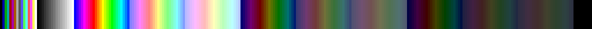

### VirtualBoy

### ZXSpectrum

## Software Palettes [from the Aseprite project](https://github.com/aseprite/aseprite/tree/8323a555007e1db9670b098ce4b1b9c5f8b3d7ad/data/extensions/software-palettes)

### GoogleUI
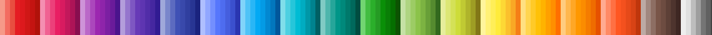

### Minecraft
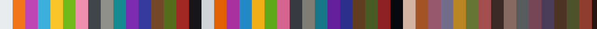

### Monokai

### SmileBasic
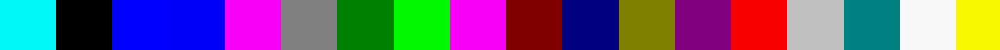

### Solarized

### Win16

### X11
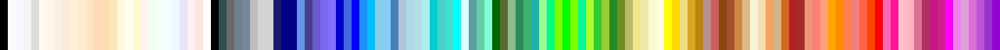
